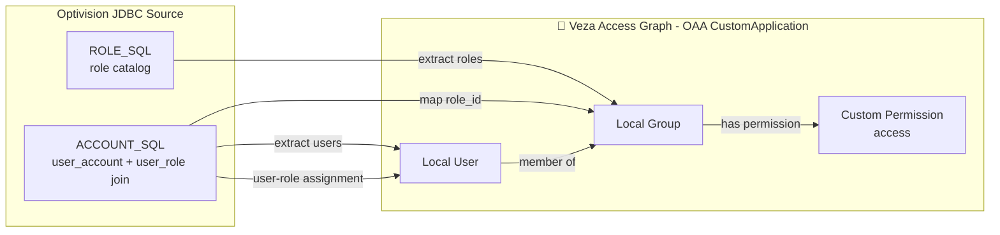

# Optivision JDBC to Veza OAA Connector

## 1. Overview

This integration reads Optivision identity and role data through JDBC and pushes it to Veza as a CustomApplication provider.

Entity mapping used by this connector:

| Source field/query output | Veza entity |
|---|---|
| account query user_id | Local User |
| role query role_id | Local Group |
| account query user_id + role_id | User to Local Group membership |
| custom permission access | Custom Permission |

Permission mapping used by this connector:

| Optivision concept | OAA permission |
|---|---|
| access | OAAPermission.DataRead |

## 2. Entity Relationship Map



## 3. How It Works

1. Loads configuration from CLI args and env file with precedence: CLI -> env -> defaults.
2. Connects to Optivision with JDBC using the static driver class com.microsoft.sqlserver.jdbc.SQLServerDriver.
3. Executes ACCOUNT_SQL to collect users plus role assignments.
4. Executes ROLE_SQL to collect the role catalog.
5. Builds an OAA CustomApplication payload with Local Users and Local Groups.
6. Optionally writes payload JSON when --save-json is passed.
7. Pushes payload to Veza unless --dry-run is provided.

## 4. Prerequisites

- Linux host for production execution
- Python 3.9+
- Network access from connector host to:
  - Optivision JDBC endpoint
  - Veza URL
- JDBC driver JAR accessible on disk
- Java runtime compatible with your JDBC jar (Oracle Java 18 is supported when your JDBC package requires it)

## 5. Quick Start

Use the installer from your own repository URL:

```bash
curl -fsSL https://raw.githubusercontent.com/<your-org>/<your-repo>/main/integrations/optivision/install_optivision.sh | bash
```

The installer does not hardcode any company URL and prompts on every run for repository URL, Veza URL, datasource naming, database name, JDBC values, and SQL queries.

## 6. Manual Installation

### RHEL / CentOS / Fedora

```bash
sudo dnf install -y git python3 python3-pip
python3 -m venv /opt/VEZA/optivision-veza/scripts/venv
/opt/VEZA/optivision-veza/scripts/venv/bin/pip install -r /opt/VEZA/optivision-veza/scripts/requirements.txt
```

### Ubuntu / Debian

```bash
sudo apt-get update
sudo apt-get install -y git python3 python3-pip python3-venv
python3 -m venv /opt/VEZA/optivision-veza/scripts/venv
/opt/VEZA/optivision-veza/scripts/venv/bin/pip install -r /opt/VEZA/optivision-veza/scripts/requirements.txt
```

Copy .env.example to a location profile under /opt/VEZA/optivision-veza/config/ and chmod 600.

## 7. Usage

Arguments:

| Argument | Required | Values | Default | Description |
|---|---|---|---|---|
| --data-dir | No | path | ./samples | Compatibility flag; not used for JDBC reads |
| --env-file | No | path | .env | Env file to load |
| --veza-url | No | URL | env VEZA_URL | Veza tenant URL |
| --veza-api-key | No | string | env VEZA_API_KEY | Veza API key |
| --provider-name | No | string | Optivision | Veza provider name |
| --datasource-name | No | string | Optivision-<location> | Veza datasource name |
| --dry-run | No | flag | false | Build payload without push |
| --save-json | No | flag | false | Save payload JSON |
| --log-level | No | DEBUG/INFO/WARNING/ERROR | INFO | Logging level |
| --location | No | string | env OPTIVISION_LOCATION | Location suffix used for datasource naming |
| --jdbc-url | No | JDBC URL | env JDBC_URL | JDBC connection URL |
| --jdbc-database-name | No | string | env JDBC_DATABASE_NAME | Database name for location-specific configuration |
| --jdbc-user | No | string | env JDBC_USER | JDBC username |
| --jdbc-password | No | string | env JDBC_PASSWORD | JDBC password |
| --jdbc-driver-class | No | class name | com.microsoft.sqlserver.jdbc.SQLServerDriver | JDBC driver class |
| --jdbc-jar-path | No | path | env JDBC_JAR_PATH | JDBC driver JAR path |
| --account-sql | No | SQL | built-in default | User and role membership query |
| --role-sql | No | SQL | built-in default | Role catalog query |

Examples:

```bash
cd /opt/VEZA/optivision-veza/scripts
./venv/bin/python3 ./optivision.py --env-file ../config/Optivision-LowMoor.env --save-json
```

Guided runtime wrapper mode (prompts at run time for credentials, database, URL, and queries):

```bash
cd /opt/VEZA/optivision-veza/scripts
./run_optivision.sh LowMoor --guided --save-json
```

You can omit the location in guided mode and it will prompt for location first:

```bash
./run_optivision.sh --guided --save-json
```

Guided mode with profile update (writes prompted values back to location env file):

```bash
./run_optivision.sh LowMoor --guided --save-profile --save-json
```

Use explicit datasource override if needed:

```bash
./venv/bin/python3 ./optivision.py --env-file ../config/Optivision-LowMoor.env --datasource-name Optivision-LowMoor --save-json
```

## 8. Deployment on Linux

Create a dedicated service account:

```bash
sudo useradd -r -s /bin/bash -m -d /opt/VEZA/optivision-veza optivision-veza
sudo chown -R optivision-veza:optivision-veza /opt/VEZA/optivision-veza
```

Permissions:

```bash
chmod 700 /opt/VEZA/optivision-veza/scripts
chmod 600 /opt/VEZA/optivision-veza/config/*.env
```

SELinux (RHEL):

```bash
getenforce
sudo restorecon -Rv /opt/VEZA/optivision-veza
```

Cron wrapper usage:

```bash
cat >/etc/cron.d/optivision-veza <<'CRON'
15 * * * * optivision-veza cd /opt/VEZA/optivision-veza/scripts && ./run_optivision.sh LowMoor --save-json >/opt/VEZA/optivision-veza/logs/cron.log 2>&1
CRON
```

Log rotation example:

```bash
cat >/etc/logrotate.d/optivision-veza <<'ROTATE'
/opt/VEZA/optivision-veza/logs/*.log {
  daily
  rotate 14
  compress
  missingok
  notifempty
  copytruncate
}
ROTATE
```

## 9. Multiple Instances / Locations

This connector is designed for multiple locations.

- Installer asks whether to add a new location or update an existing location.
- Installer re-prompts all location-specific values each run (user, password, database name, JDBC URL/options, datasource name, SQL queries).
- Each location has its own env file: /opt/VEZA/optivision-veza/config/Optivision-Location.env
- Runtime wrapper also supports guided prompts per execution using --guided, with optional --save-profile to update that location env file.
- In guided mode, location can be passed or prompted interactively.
- Datasource naming standard: Optivision-Location
- Re-run installer at any time to onboard another location without replacing others.

## 10. Security Considerations

- Keep env files at chmod 600.
- Rotate Veza and database credentials regularly.
- Avoid embedding credentials in command history.
- Restrict directory ownership to the integration service account.

## 11. Troubleshooting

- JDBC class not found:
  - Verify JDBC_JAR_PATH points to the correct driver JAR.
  - Confirm JDBC_DRIVER_CLASS is com.microsoft.sqlserver.jdbc.SQLServerDriver.
- Connection failed:
  - Validate host/port/database in JDBC_URL.
  - Validate JDBC user and password.
- Veza push failed:
  - Check VEZA_URL and VEZA_API_KEY.
  - Retry with --save-json and inspect output payload.

## 12. Changelog

- v1.0.0
  - Initial Optivision JDBC connector
  - Multi-location installer with add/update workflow
  - /opt/VEZA installation layout with milestone progress output
